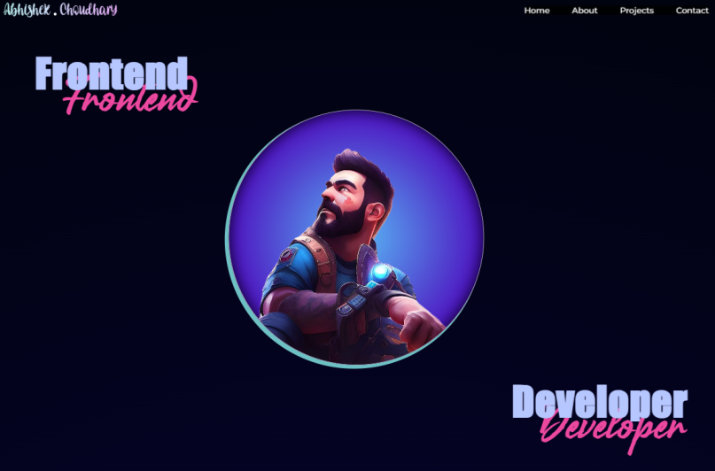
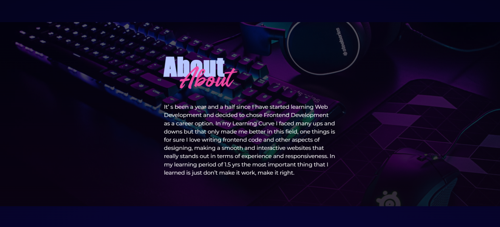
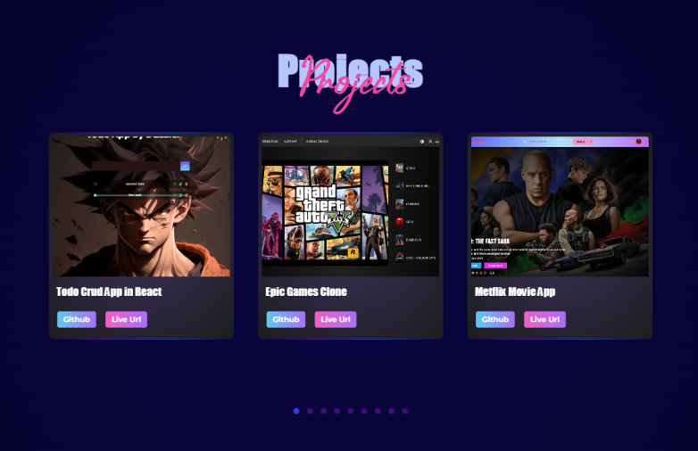
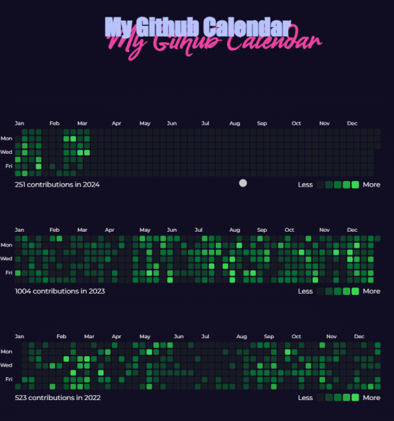
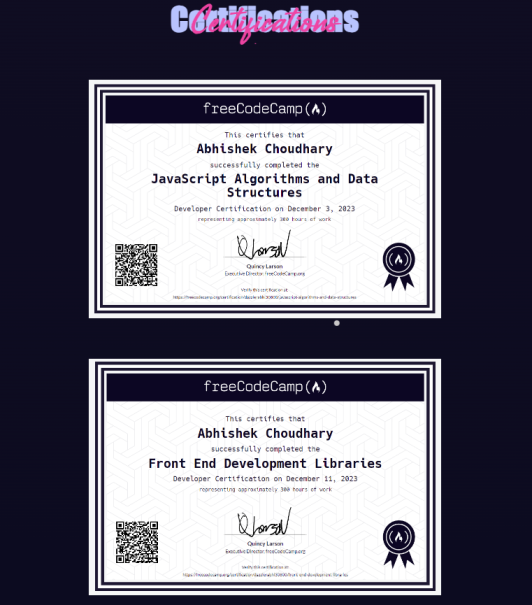
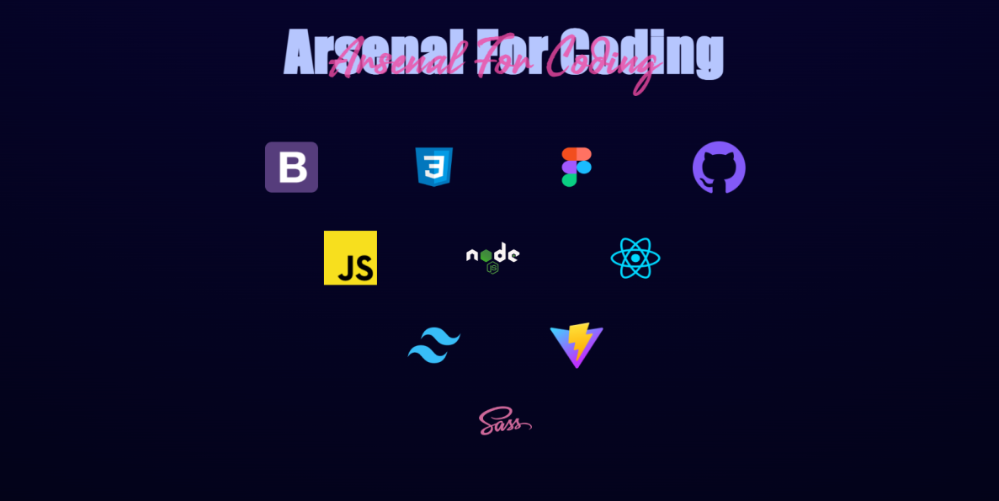

# Portolio Website

## Tech Stack

- Library :- ReactJS
- IDE :- vscode, neovim
- React Icons :- icons
- Animations: GSAP & AOS(animate on scroll)
- CSS :- Vanilla CSS
- React Github Calendar :- github contribution component

## How to run locally

1. First you have to create a account on appwrite, then create a projects, attributes for what your todo object will contain.
2. Copy your database id, collection id to the appwrite file.
3. Then clone or fork this repo, run the command `npm install` to install the dependencies, after that run the server using `npm run dev`.

### View the live Site here <ins>_[Live Site](https://abhishek-choudhary-portfolio-nu.vercel.app)_</ins>

## How UI looks like

### Hero Section

### About Section

### Projects Section

### Github Calendar Section

### Certification Section

<!--  -->

    

### Tech Stack Section

    </img>

